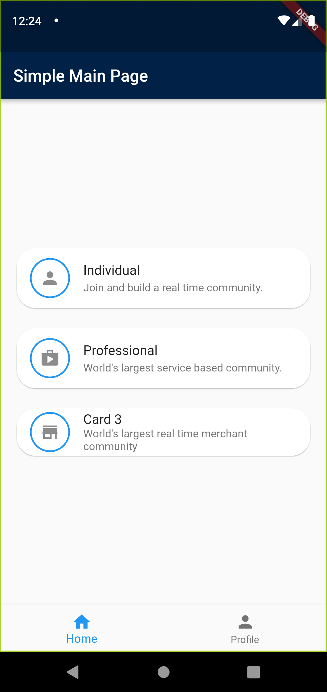
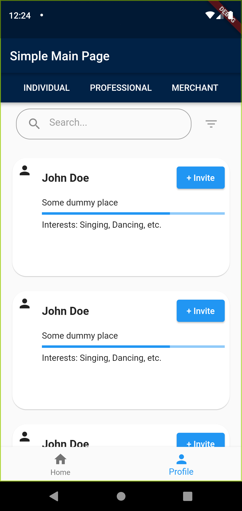

# blackcoffer

This project is a part of my internship assignment for selection and consists of several pages developed using Flutter.

## Installation

To install and run the app, follow these steps:

1. Download the APK file from the [Releases](https://github.com/navaneethkulal8/blackcofferintern/blob/main/app-release.apk)
2. Transfer the APK file to your Android device.
3. On your Android device, navigate to the location of the APK file using a file manager app.
4. Tap on the APK file to start the installation process.
5. Follow the on-screen instructions to complete the installation.
6. Once installed, you can find the app on your device and launch it.

## Screenshots

Here are some screenshots of the app:

  
  

